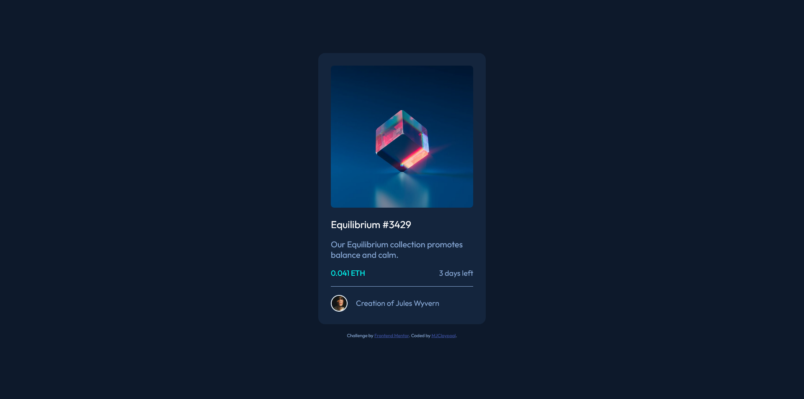

# Frontend Mentor - NFT preview card component solution

This is a solution to the [NFT preview card component challenge on Frontend Mentor](https://www.frontendmentor.io/challenges/nft-preview-card-component-SbdUL_w0U). Frontend Mentor challenges help you improve your coding skills by building realistic projects. 

## Table of contents

- [Overview](#overview)
  - [The challenge](#the-challenge)
  - [Screenshot](#screenshot)
- [My process](#my-process)
  - [Built with](#built-with)
  - [What I learned](#what-i-learned)
  - [Continued development](#continued-development)
  - [Useful resources](#useful-resources)
- [Author](#author)

## Overview

### The challenge

Users should be able to:

- View the optimal layout depending on their device's screen size
- See hover states for interactive elements

### Screenshot



## My process

### Built with

- Semantic HTML5
- CSS

### What I learned

I learned how to overlay an icon and a semi-transparent box over an image while hovering. Using the :hover pseudo-class, a view icon becomes fully opaque and a colored background appears over the main image while hovering over the region.

```css
img.view {
    width: 50px;
    height: 50px;
    padding: 130px;
    border-radius: 8px;
    opacity: 0;
}
```
```css
img.view:hover {
    background: rgba(0, 255, 247, 0.4);
    opacity: 1.0;
}
```

### Continued development

Working to improve my use of flex and containers that resize their contents automatically with changes to the viewport.

### Useful resources

- [W3School - CSS Opacity / Transparency](https://www.w3schools.com/css/css_image_transparency.asp) - This helped me build a semi-transparent colored box without changing the opacity of the icon within it.

## Author

- Frontend Mentor - [@mjclaypool](https://www.frontendmentor.io/profile/mjclaypool)
