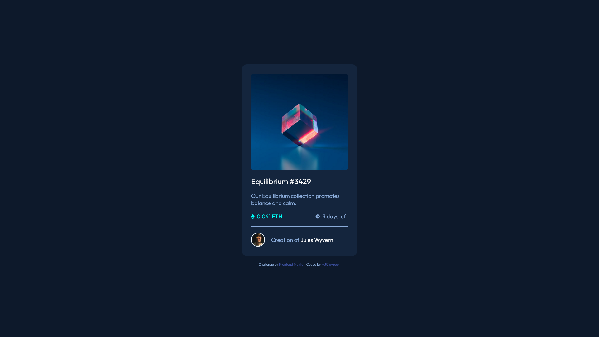

# Frontend Mentor - NFT preview card component solution

This is a solution to the [NFT preview card component challenge on Frontend Mentor](https://www.frontendmentor.io/challenges/nft-preview-card-component-SbdUL_w0U). Frontend Mentor challenges help you improve your coding skills by building realistic projects.

## Table of contents

- [Overview](#overview)
  - [The challenge](#the-challenge)
  - [Screenshot](#screenshot)
  - [Links](#links)
  - [Built with](#built-with)
- [Author](#author)

## Overview

### The challenge

Users should be able to:

- View the optimal layout depending on their device's screen size
- See hover states for interactive elements

### Screenshot

### Links

- Solution URL: [Repository Link](https://github.com/mjclaypool/Rock-Paper-Scissors)
- Live Site URL: [Live Link](https://mjclaypool.github.io/Rock-Paper-Scissors/)

### Built with

- Semantic HTML5
- CSS custom properties
- Flexbox
- Mobile-first workflow

## Author

- Website - [Mallory Claypool](https://mjclaypool.github.io/Personal-Portfolio/)
- Frontend Mentor - [@mjclaypool](https://www.frontendmentor.io/profile/mjclaypool)
